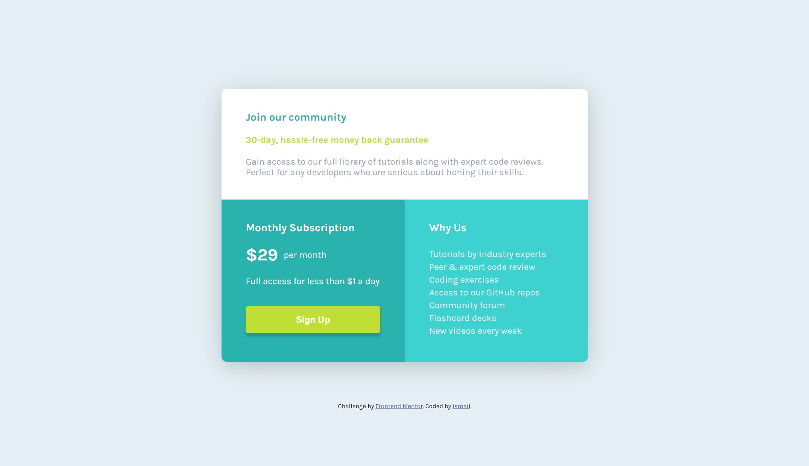

# Frontend Mentor - Single price grid component solution

This is a solution to the [Single price grid component challenge on Frontend Mentor](https://www.frontendmentor.io/challenges/single-price-grid-component-5ce41129d0ff452fec5abbbc). Frontend Mentor challenges help you improve your coding skills by building realistic projects.

## Table of contents

- [Overview](#overview)
  - [The challenge](#the-challenge)
  - [Screenshot](#screenshot)
  - [Links](#links)
- [My process](#my-process)
  - [Built with](#built-with)
  - [What I learned](#what-i-learned)
- [Author](#author)

## Overview

To create a price component using css grid as close to the design files provided.

### The challenge

Users should be able to:

- View the optimal layout for the component depending on their device's screen size
- See a hover state on desktop for the Sign Up call-to-action

### Screenshot



### Links

- Solution URL: [here](https://github.com/Ishi1834/single-price-grid-component)
- Live Site URL: [here](https://ishi1834.github.io/single-price-grid-component/)

### Built with

- Semantic HTML5 markup
- CSS custom properties
- Flexbox
- CSS Grid
- Mobile-first workflow

### What I learned

How to use css Grid:

```css
main {
  display: grid;
  grid-template-columns: 1fr;
  margin: 15vw 6vw 5vw 6vw;
  max-width: 500px;
  border-radius: 10px;
  overflow: hidden;
  box-shadow: rgba(0, 0, 0, 0.1) 0px 10px 30px, rgba(0, 0, 0, 0.1) 0px 5px 60px;
}
```

## Author

- Github - [@Ishi1834](https://github.com/Ishi1834)
- Frontend Mentor - [@Ishi1834](https://www.frontendmentor.io/profile/Ishi1834)
- CodePen - [@sadiq1834](https://codepen.io/sadiq1834)
